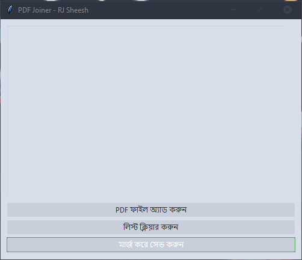

# PDF Joiner (পিডিএফ জোড়া লাগানোর টুল)

এটা একটা সাধারণ ডেস্কটপ অ্যাপ্লিকেশন। এটা দিয়ে আপনি অনেকগুলো PDF ফাইল একসাথে জোড়া লাগিয়ে (merge) একটা ফাইল হিসেবে সেভ করতে পারবেন।

---

## ✨ ফিচারসমূহ (Features)

* সহজে এক বা একাধিক PDF ফাইল অ্যাড করা।
* অ্যাড করা ফাইলের তালিকা দেখা।
* এক ক্লিকে পুরো তালিকা পরিষ্কার করা (Clear List)।
* ফাইলগুলো মার্জ করে পছন্দমতো নামে সেভ করা।

---

* "PDF ফাইল অ্যাড করুন" বাটনে ক্লিক করে আপনার PDF ফাইলগুলো সিলেক্ট করুন (আপনি একসাথে একাধিক ফাইল সিলেক্ট করতে পারবেন)।
* ফাইলগুলো লিস্টে চলে আসবে।
* সবগুলো ফাইল অ্যাড করা শেষ হলে "মার্জ করে সেভ করুন" বাটনে ক্লিক করুন।
* একটি সেভ ডায়ালগ আসবে। আপনার নতুন, মার্জ করা ফাইলটির একটি নাম দিন এবং সেভ করুন।
